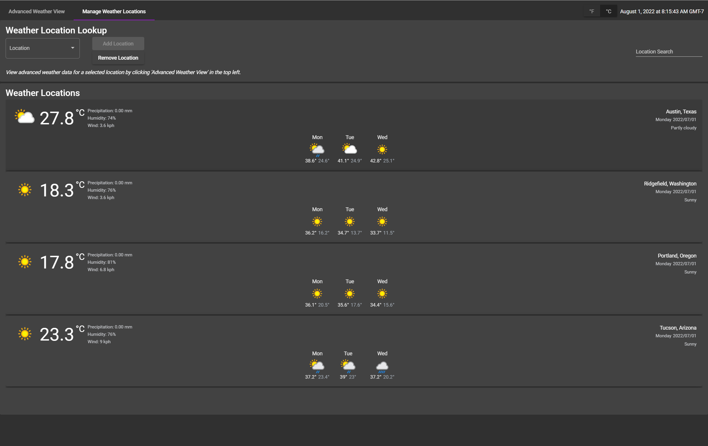

WeatherAPI App
=========

This is a demo weather forecast application for a job interview. It is using weather api provided by https://www.weatherapi.com/docs/weather_conditions.json.

This project was generated with [Angular CLI](https://github.com/angular/angular-cli) version 14.1.0, and heavily utilizes the [Angular Material library](https://material.angular.io/) for UI components.

This website was built over a weekend so more features could be added but this is supposed to be a functional MVP of what the feature complete application would look like.

Users can use the page to search locations, add them to a home page / tracking area. Locations can be removed, and viewed in an advanced weather view where more information is visible using a combination of cards, and graphs / charts.

Recommendations: 
* When getting started I recommend added a few locations, I like testing with (enter these exactly in the search field):
  * `Austin, Texas`
  * `Ridgefield, Washington`
  * `Tucson, Arizona`

Warnings:
* The search API for this weather API is fairly sucky, so I recommend typing things more explicity to find what you're looking for. Typically typing something like City, State, will bring up the location. You can also search by zipcodes, but the API doesn't return any info tying locations back to ZIP codes, so the search field cannot let you search by them like the API does.

Preview
============

### Home Page / Basic Weather View

### Advanced View

Table of contents
=================
<!--ts-->
* [Installation](#installation)
* [Development Server](#development-server)
* [Build](#build)
* [Running Unit Tests](#running-unit-tests)
<!--te-->

Installation
============
Run `npm install` in the project folder to install the needed dependencies for building and running a dev version of the app.

There is an API key required for the weather api to work. I included mine for quicker testing by people reviewing the project. In a normal production app I would never include the key in the UI like I have done here.

Development server
============

Run `ng serve` for a dev server. Navigate to `http://localhost:4200/`. The application will automatically reload if you change any of the source files.

Build
============

Run `ng build` to build the project. The build artifacts will be stored in the `dist/` directory.

## Running unit tests

Run `ng test` to execute the unit tests via [Karma](https://karma-runner.github.io).

## Further help

To get more help on the Angular CLI use `ng help` or go check out the [Angular CLI Overview and Command Reference](https://angular.io/cli) page.
